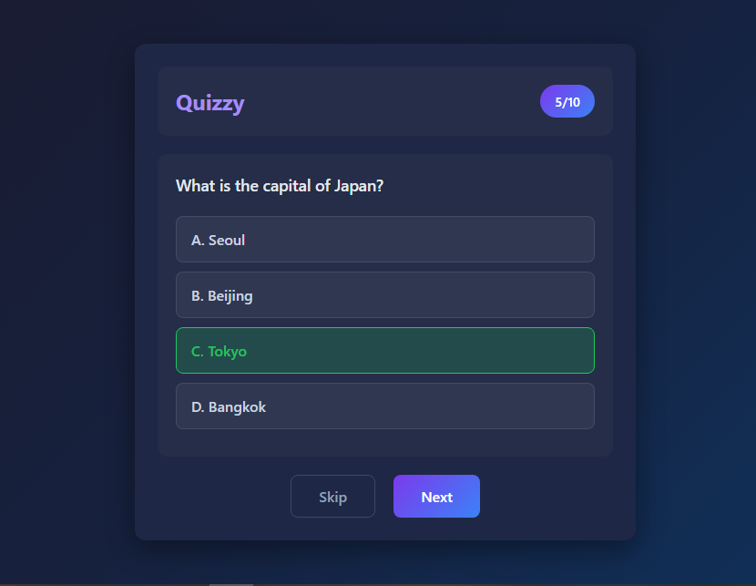

# 🧠 Interactive Quiz App

[](https://anjumhere.github.io/interactive-quiz/)
[](https://github.com/anjumhere/interactive-quiz)
[](https://developer.mozilla.org/en-US/docs/Web/JavaScript)

A modern, beginner-friendly quiz application built with vanilla HTML, CSS, and JavaScript. Perfect for learning web development fundamentals!



---

## 🌟 Live Demo

👉 **[Try the Quiz App Here](https://anjumhere.github.io/interactive-quiz/)**

---

## 📋 Table of Contents

- [Features](#-features)
- [What You'll Learn](#-what-youll-learn)
- [Technologies Used](#-technologies-used)
- [Project Structure](#-project-structure)
- [Getting Started](#-getting-started)
- [How It Works](#-how-it-works)
- [Code Concepts Explained](#-code-concepts-explained)
- [Question Bank](#-question-bank)
- [Customization](#-customization)
- [Contributing](#-contributing)
- [Author](#-author)
- [License](#-license)

---

## ✨ Features

| Feature                  | Description                               |
| ------------------------ | ----------------------------------------- |
| 🎲 **Random Questions**  | 10 random questions from a bank of 100    |
| ✅ **Instant Feedback**  | Visual feedback for correct/wrong answers |
| 📊 **Progress Tracking** | See your progress (1/10, 2/10, etc.)      |
| ⏭️ **Skip Option**       | Skip difficult questions                  |
| 🏆 **Score Display**     | Final score with percentage               |
| 🔄 **Restart Quiz**      | Play again with new random questions      |
| 📱 **Responsive Design** | Works on desktop, tablet, and mobile      |
| 🎨 **Modern UI**         | Clean, dark theme interface               |

---

## 📚 What You'll Learn

This project is designed for **beginners** who want to learn web development. Here's what you can learn:

### 🟢 HTML Concepts

- Document structure (`<!DOCTYPE html>`, `<head>`, `<body>`)
- Semantic elements (`<header>`, `<section>`)
- Lists (`<ul>`, `<li>`)
- Buttons and forms
- Custom data attributes (`data-index`)
- Linking CSS and JavaScript files

### 🔵 CSS Concepts

- CSS selectors (class, ID, element)
- Flexbox for layouts
- CSS gradients
- Box model (margin, padding, border)
- Hover effects and transitions
- Responsive design with media queries
- CSS custom properties

### 🟡 JavaScript Concepts

- DOM manipulation (`querySelector`, `getElementById`)
- Event listeners (`click` events)
- Arrays and Objects
- Functions (declaration and arrow functions)
- Loops (`for`, `forEach`)
- Conditionals (`if/else`)
- Array methods (`slice`, `forEach`)
- Template literals (backticks)
- `setTimeout` for delays
- Fisher-Yates shuffle algorithm

---

## 🛠️ Technologies Used

| Technology                                                                                               | Purpose                 |
| -------------------------------------------------------------------------------------------------------- | ----------------------- |
|                 | Structure and content   |
|                    | Styling and layout      |
|  | Logic and interactivity |

**No frameworks or libraries required!** This is pure vanilla web development.

---

## 📁 Project Structure

```
quiz-app/
│
├── index.html              # Main HTML file (structure of the app)
├── style.css               # Styles for the app
├── app.js                  # Main JavaScript logic
│
├── images/                 # All images used in the app
│   └── Screenshot.png      # App screenshot
│
└── questions/              # Question data
    └── questions.js        # Array of quiz questions
```

### File Descriptions

| File           | Purpose                                                                         |
| -------------- | ------------------------------------------------------------------------------- |
| `index.html`   | Contains the HTML structure - the quiz container, header, options, and buttons  |
| `style.css`    | Contains all styling - colors, layout, hover effects, responsive design         |
| `app.js`       | Contains the quiz logic - loading questions, handling clicks, calculating score |
| `questions.js` | Contains 100 questions organized by category                                    |

---

## 🚀 Getting Started

### Option 1: Clone the Repository

```bash
# Clone the repository
git clone https://github.com/anjumhere/interactive-quiz.git

# Navigate to the project folder
cd interactive-quiz

# Open in your browser
# Simply double-click index.html or use a live server
```

### Option 2: Download ZIP

1. Click the green **"Code"** button on GitHub
2. Select **"Download ZIP"**
3. Extract the ZIP file
4. Open `index.html` in your browser

### Option 3: Use Live Server (Recommended for Development)

If you're using VS Code:

1. Install the **"Live Server"** extension
2. Right-click on `index.html`
3. Select **"Open with Live Server"**

---

## ⚙️ How It Works

### Quiz Flow

```
┌─────────────────┐
│   Page Loads    │
└────────┬────────┘
         ▼
┌─────────────────┐
│ Shuffle & Pick  │
│  10 Questions   │
└────────┬────────┘
         ▼
┌─────────────────┐
│ Display First   │
│    Question     │◄──────────────┐
└────────┬────────┘               │
         ▼                        │
┌─────────────────┐               │
│  User Selects   │               │
│   An Option     │               │
└────────┬────────┘               │
         ▼                        │
┌─────────────────┐               │
│ Show Correct/   │               │
│  Wrong Answer   │               │
└────────┬────────┘               │
         ▼                        │
┌─────────────────┐               │
│ User Clicks     │               │
│     Next        │               │
└────────┬────────┘               │
         ▼                        │
┌─────────────────┐    No         │
│ More Questions? ├───────────────┘
└────────┬────────┘
         │ Yes (Quiz Complete)
         ▼
┌─────────────────┐
│  Show Results   │
│  & Final Score  │
└────────┬────────┘
         ▼
┌─────────────────┐
│ Restart Button  │──► Reload Page
└─────────────────┘
```

---

## 💡 Code Concepts Explained

### 1. Getting HTML Elements

```javascript
// querySelector - finds ONE element by CSS selector
let questionEl = document.querySelector(".question");

// getElementById - finds element by its ID
let progressEl = document.getElementById("progress");
```

### 2. Arrays and Objects

```javascript
// This is an ARRAY (list) of OBJECTS
const questions = [
  {
    question: "What is 2 + 2?", // Property
    options: ["3", "4", "5", "6"], // Array inside object
    correct: 1, // Index of correct answer
  },
];

// Accessing data
questions[0].question; // "What is 2 + 2?"
questions[0].options[1]; // "4"
questions[0].correct; // 1
```

### 3. The Shuffle Algorithm

```javascript
function shuffleArray(array) {
  let shuffled = [...array]; // Create a copy

  // Loop backwards through the array
  for (let i = shuffled.length - 1; i > 0; i--) {
    // Pick a random index
    let j = Math.floor(Math.random() * (i + 1));

    // Swap elements
    [shuffled[i], shuffled[j]] = [shuffled[j], shuffled[i]];
  }

  return shuffled;
}
```

### 4. Creating Elements Dynamically

```javascript
// Create new element
let li = document.createElement("li");

// Add class
li.className = "option";

// Add content
li.innerHTML = "<span>A.</span> Option text";

// Add to page
list.appendChild(li);
```

### 5. Event Listeners

```javascript
// When button is clicked, run this function
nextBtn.addEventListener("click", function () {
  nextQuestion();
});
```

---

## 📝 Question Bank

The quiz includes **100 questions** across 6 categories:

| Category         | Questions | Topics                                  |
| ---------------- | --------- | --------------------------------------- |
| 🔬 Science       | 20        | Chemistry, Biology, Physics, Space      |
| 🌍 Geography     | 20        | Countries, Capitals, Rivers, Mountains  |
| 📜 History       | 20        | Wars, Inventions, Famous People         |
| ⚽ Sports        | 15        | Football, Olympics, Tennis, Cricket     |
| 🎬 Entertainment | 15        | Movies, Music, Books, TV Shows          |
| 💡 General       | 10        | Currency, Language, Food, Miscellaneous |

### Question Format

```javascript
{
    question: "What is the capital of Japan?",
    options: ["Seoul", "Beijing", "Tokyo", "Bangkok"],
    correct: 2  // Index of "Tokyo"
}
```

---

## 🎨 Customization

### Change Number of Questions

In `app.js`, modify:

```javascript
const TOTAL_QUESTIONS = 10; // Change to any number
```

### Add Your Own Questions

In `questions/questions.js`, add to the array:

```javascript
{
    question: "Your question here?",
    options: ["Option A", "Option B", "Option C", "Option D"],
    correct: 0  // Index of correct answer (0-3)
}
```

### Change Colors

In `style.css`, modify these values:

```css
/* Main background */
background: linear-gradient(135deg, #1a1a2e, #16213e, #0f3460);

/* Accent color (purple) */
background: linear-gradient(135deg, #7c3aed, #3b82f6);
```

---

## 🤝 Contributing

Contributions are welcome! Here's how:

1. **Fork** the repository
2. **Create** a new branch (`git checkout -b feature/new-feature`)
3. **Make** your changes
4. **Commit** your changes (`git commit -m 'Add new feature'`)
5. **Push** to the branch (`git push origin feature/new-feature`)
6. **Open** a Pull Request

### Ideas for Contributions

- [✅] Add more questions
- [✅] Add a timer feature
- [ ] Add difficulty levels
- [ ] Add sound effects
- [ ] Add category selection
- [ ] Add high score storage (localStorage)
- [ ] Add animations
- [ ] Improve accessibility
- [ ] Fetch questions from an API

---

## 🐛 Known Issues & Solutions

| Issue                 | Solution                                               |
| --------------------- | ------------------------------------------------------ |
| Questions not loading | Make sure `questions.js` is in the `questions/` folder |
| Styles not applying   | Check that `style.css` is in the root folder           |
| Cannot select options | Ensure JavaScript is enabled in your browser           |

---

## 📖 Learning Resources

Want to learn more? Check out these resources:

- [MDN Web Docs - JavaScript](https://developer.mozilla.org/en-US/docs/Web/JavaScript)
- [W3Schools - HTML Tutorial](https://www.w3schools.com/html/)
- [CSS-Tricks - Flexbox Guide](https://css-tricks.com/snippets/css/a-guide-to-flexbox/)
- [JavaScript.info](https://javascript.info/)

---

## 👤 Author

**Adnan Anjum**

- GitHub: [@anjumhere](https://github.com/anjumhere)
- Project: [Interactive Quiz](https://github.com/anjumhere/interactive-quiz)

---

## ⭐ Show Your Support

If you found this project helpful, please consider:

- ⭐ **Starring** this repository
- 🍴 **Forking** to create your own version
- 📢 **Sharing** with others who want to learn

---

## 📄 License

This project is open source and available under the [MIT License](LICENSE).

```
MIT License

Copyright (c) 2024 Adnan Anjum

Permission is hereby granted, free of charge, to any person obtaining a copy
of this software and associated documentation files (the "Software"), to deal
in the Software without restriction, including without limitation the rights
to use, copy, modify, merge, publish, distribute, sublicense, and/or sell
copies of the Software, and to permit persons to whom the Software is
furnished to do so, subject to the following conditions:

The above copyright notice and this permission notice shall be included in all
copies or substantial portions of the Software.

THE SOFTWARE IS PROVIDED "AS IS", WITHOUT WARRANTY OF ANY KIND, EXPRESS OR
IMPLIED, INCLUDING BUT NOT LIMITED TO THE WARRANTIES OF MERCHANTABILITY,
FITNESS FOR A PARTICULAR PURPOSE AND NONINFRINGEMENT. IN NO EVENT SHALL THE
AUTHORS OR COPYRIGHT HOLDERS BE LIABLE FOR ANY CLAIM, DAMAGES OR OTHER
LIABILITY, WHETHER IN AN ACTION OF CONTRACT, TORT OR OTHERWISE, ARISING FROM,
OUT OF OR IN CONNECTION WITH THE SOFTWARE OR THE USE OR OTHER DEALINGS IN THE
SOFTWARE.
```

---

## 🙏 Acknowledgments

- Question content sourced from general knowledge databases
- Inspired by various quiz applications
- Built for the web development learning community

---

<p align="center">
  Made with ❤️ for beginners learning web development
</p>

<p align="center">
  <strong>Author: Adnan Anjum</strong>
</p>

<p align="center">
  <a href="https://anjumhere.github.io/interactive-quiz/">Live Demo</a> •
  <a href="https://github.com/anjumhere/interactive-quiz">GitHub Repo</a>
</p>
